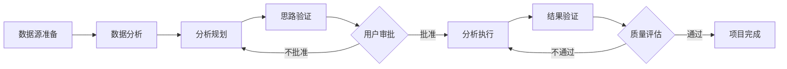

# Claude Code 自动化数据分析系统

## 📋 项目概述

Claude Code 自动化数据分析系统是一个基于 Multi-Agent 架构的通用数据分析框架，通过多个专门 Agent 的协作，实现从数据源分析到结果验证的完整流程自动化。系统能够智能地处理各种格式的数据文件，自动生成分析规划，并通过 Jupyter Notebook 执行分析任务。

### 🎯 核心特性

- **Multi-Agent 协作**：5 个专门 Agent 分工明确，协同完成复杂数据分析任务
- **自动化流程**：从数据读取到结果验证的全流程自动化
- **任务隔离**：每个分析任务独立存档，支持并行执行和历史追溯
- **智能验证**：自动验证分析思路和执行结果，确保分析质量
- **灵活扩展**：模块化设计，易于添加新的 Agent 和分析能力

## 🏗️ 系统架构

### Agent 体系

```
主流程协调器（Claude Assistant）
    ├── DataSourceFileAnalysisAgent（数据源分析）
    ├── AnalysisIdeaPlanningAgent（分析规划）
    ├── IdeaValidationAgent（思路验证）
    ├── AnalysisExecutionAgent（分析执行）
    └── ResultValidationAgent（结果验证）
```

### 工作流程



## 🚀 快速开始

### 环境要求

- **Python 3.8+**（推荐使用 Conda base 环境）
- **Node.js 14+**
- **Jupyter Notebook**
- **Windows 操作系统**（PowerShell 终端）

### 安装步骤

1. **克隆项目**
```bash
git clone <repository-url>
cd "D:\Desktop\data\数据复盘\Claude Code Auto Analysis"
```

2. **安装 Python 依赖**
```bash
pip install -r requirements.txt
```

3. **安装 Node.js 依赖**
```bash
npm install
```

4. **配置 MCP 服务器**
- 确保 `.mcp.json` 配置正确
- 验证 Jupyter 根目录访问权限

### 使用方法

1. **准备数据源**
   - 在 `archives/{task_name}/data_source/raw/` 目录下放置原始数据文件
   - 支持格式：CSV、Excel、Markdown、Word 等

2. **创建任务背景文件**
   - 在 `archives/{task_name}/docs/` 目录下创建 `task_background.md`
   - 包含：project_name、分析目标、关键指标等

3. **启动分析流程**
   - 通过 Claude Code 启动主流程协调器
   - 系统将自动执行完整的分析流程

## 📂 项目结构

```
Claude Code Auto Analysis/
├── Agents/                     # Agent 实现文档
│   ├── DataSourceFileAnalysisAgent.md
│   ├── AnalysisIdeaPlanningAgent.md
│   ├── IdeaValidationAgent.md
│   ├── AnalysisExecutionAgent.md
│   └── ResultValidationAgent.md
├── tools/                      # 工具脚本
│   ├── data_readers/          # 数据读取工具
│   ├── notebook_runners/      # Notebook 运行器
│   └── notebook_config/       # Notebook 配置
├── project_config/            # 项目配置
│   └── project_context.json  # 全局上下文
├── archives/                  # 任务存档
│   └── {task_name}/          # 单个任务目录
│       ├── data_source/      # 数据源文件
│       ├── docs/             # 文档和规划
│       └── logs/             # 执行日志
├── CLAUDE.md                  # Claude Code 配置
├── requirements.txt           # Python 依赖
├── package.json              # Node.js 依赖
└── README.md                 # 本文档
```

## 🔧 核心组件说明

### 1. 主流程协调器

负责整个系统的调度和状态管理：
- 项目初始化和配置管理
- Agent 任务分发和协调
- 用户交互和审批流程
- 状态同步和错误处理

### 2. DataSourceFileAnalysisAgent

自动分析和描述数据源文件：
- **结构化数据**：生成 JSON 格式描述文件，包含数据结构、类型、采样等信息
- **非结构化数据**：生成增强版 Markdown 描述，保留完整上下文信息
- 支持大文件自动分割和图片提取

### 3. AnalysisIdeaPlanningAgent

基于数据源和任务背景生成分析规划：
- 制定详细的分析步骤和方法论
- 映射数据源到分析目标
- 设计 Notebook 结构和输出形式

### 4. IdeaValidationAgent

验证分析规划的合理性：
- 评估数据可用性和完整性
- 检查分析方法的适用性
- 生成详细的验证报告供用户审批

### 5. AnalysisExecutionAgent

执行分析规划并生成 Notebook：
- 逐步生成和执行代码单元格
- 实时验证执行结果
- 自动处理错误和异常

### 6. ResultValidationAgent

验证分析结果的质量：
- 检查数据一致性和完整性
- 评估分析结论的合理性
- 生成质量评分和改进建议

## 🛠️ 工具脚本

### data_readers（数据读取工具）

- `file_classifier.py`：智能文件类型分类
- `read_structured_data.py`：结构化数据处理
- `document_parser.py`：非结构化文档解析
- `file_splitter.py`：大文件智能分割
- `frontmatter_tool.py`：Frontmatter 元数据管理

### notebook_runners（Notebook 运行器）

- `nb_runner.py`：Notebook 执行和管理
  - 支持全量执行或部分执行
  - 提供执行结果验证
  - 错误处理和日志记录

### notebook_config（环境配置）

- `notebook_env_config.md`：标准环境初始化模板
  - 基础库导入配置
  - 中文显示优化
  - 可视化设置

## 📊 数据处理流程

```
原始文件
    ↓
文件分类（file_classifier.py）
    ↓
┌──────────────┬──────────────┐
│  结构化数据   │  非结构化数据  │
│     ↓        │      ↓       │
│ 读取和采样    │   文档解析    │
│     ↓        │      ↓       │
│ JSON 描述    │   MD 描述     │
└──────────────┴──────────────┘
    ↓
分析规划生成
    ↓
用户验证审批
    ↓
Notebook 执行
    ↓
结果验证
```

## 🔄 任务管理

### 任务隔离机制

每个分析任务都有独立的存档目录：
- `archives/{task_name}/data_source/`：数据源文件
- `archives/{task_name}/docs/`：文档和规划
- `archives/{task_name}/logs/`：执行日志

### 状态追踪

通过 `project_context.json` 实时追踪：
- 当前执行阶段（current_phase）
- 处理进度统计（counts）
- 质量评分（scores）
- 错误和建议（recommendations）

## 🔐 安全与隐私

- 日志脱敏处理，不记录敏感数据
- 任务隔离，避免数据混用
- 原子操作，确保数据一致性
- 权限控制，限制文件访问范围

## 📝 配置说明

### 环境变量

- `JUPYTER_ROOT`：Jupyter Notebook 根目录（默认：`D:\Program\jupyter`）
- `PROJECT_ROOT`：项目根目录

### 配置文件

- `.mcp.json`：MCP 服务器配置
- `CLAUDE.md`：Claude Code 项目配置
- `project_context.json`：运行时上下文

## 🤝 贡献指南

1. 遵循现有的代码风格和命名规范
2. 新增 Agent 需要更新相关文档
3. 工具脚本需要提供详细的 README
4. 提交前进行充分的测试

## 📄 许可证

[许可证信息待添加]

## 📞 联系支持

- GitHub Issues：[问题反馈]
- 文档站点：[文档链接]

---

*Built with Claude Code Multi-Agent System*