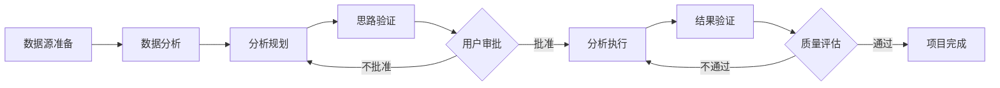

# Claude Code 自动化数据分析系统

## 📋 项目概述

Claude Code 自动化数据分析系统是一个基于 Multi-Agent 架构的通用数据分析框架，通过多个专门 Agent 的协作，实现从数据源分析到结果验证的完整流程自动化。系统能够智能地处理各种格式的数据文件，自动生成分析规划，并通过 Jupyter Notebook 执行分析任务。

### 🎯 核心特性

- **Multi-Agent 协作**：5 个专门 Agent 分工明确，协同完成复杂数据分析任务
- **自动化流程**：从数据读取到结果验证的全流程自动化
- **任务隔离**：每个分析任务独立存档，支持并行执行和历史追溯
- **智能验证**：自动验证分析思路和执行结果，确保分析质量
- **灵活扩展**：模块化设计，易于添加新的 Agent 和分析能力

## 🏗️ 系统架构

### Agent 体系

```
主流程协调器（Claude Assistant）
    ├── DataSourceFileAnalysisAgent（数据源分析）
    │   └── 调用 NonstructuredSummaryAgent（非结构化数据摘要生成）
    ├── AnalysisIdeaPlanningAgent（分析规划）
    ├── IdeaValidationAgent（思路验证）
    ├── AnalysisExecutionAgent（分析执行）
    │   └── 调用 NotebookExecutorAgent（Notebook执行专家）
    └── ResultValidationAgent（结果验证）
```

**Agent 分类说明**：
- **主 Agent**（`Agents/` 目录）：由主流程协调器直接扮演的Agent角色
- **Sub-Agent**（`.claude/agents/` 目录）：通过Task工具调用的专门子代理

### 工作流程



## 🚀 快速开始

### 环境要求

- **Python 3.8+**（推荐使用 Conda base 环境）
- **Jupyter Notebook**
- **Windows 操作系统**（PowerShell 终端）

### 安装步骤

1. **克隆项目**
```bash
git clone <repository-url>
cd "D:\Desktop\data\数据复盘\Claude Code Auto Analysis"
```

2. **安装 Python 依赖**
```bash
pip install -r requirements.txt
```

3. **配置 API 服务**
```bash
# 复制配置模板
cp config/config.example.json config/config.json
# 编辑 config/config.json 填入你的 API 密钥
```

4. **配置 MCP 服务器**
- 确保 `.mcp.json` 配置正确
- 验证 Jupyter 根目录访问权限

### 使用方法

1. **准备数据源**
   - 在 `archives/{task_name}/data_source/raw/` 目录下放置原始数据文件
   - 支持格式：CSV、Excel、Markdown、Word 等

2. **创建任务背景文件**
   - 在 `archives/{task_name}/docs/` 目录下创建 `task_background.md`
   - 包含：project_name、分析目标、关键指标等

3. **启动分析流程**
   - 通过 Claude Code 启动主流程协调器
   - 系统将自动执行完整的分析流程

## 📂 项目结构

```
Claude Code Auto Analysis/
├── .claude/                     # Claude Code Sub-Agent目录
│   ├── agents/                  # 真正的Sub-Agent（通过Task工具调用）
│   │   ├── NonstructuredSummaryAgent.md    # 非结构化数据处理与摘要生成Agent
│   │   └── NotebookExecutorAgent.md        # Notebook执行专家Agent
│   └── settings.local.json      # Claude Code本地配置
├── Agents/                      # 主流程协调器扮演的Agent角色文档
│   ├── DataSourceFileAnalysisAgent.md      # 数据源文件分析Agent
│   ├── AnalysisIdeaPlanningAgent.md        # 分析思路规划Agent
│   ├── IdeaValidationAgent.md              # 思路验证Agent
│   ├── AnalysisExecutionAgent.md           # 分析执行Agent
│   └── ResultValidationAgent.md            # 结果验证Agent
├── config/                      # 配置文件目录
│   ├── README.md               # 配置说明（支持多种API）
│   ├── config.example.json     # 配置模板
│   └── config.json             # 实际配置文件
├── tools/                       # 工具脚本
│   ├── data_readers/           # 数据读取工具
│   ├── notebook_runners/       # Notebook 运行器
│   │   ├── core/              # 核心功能模块
│   │   └── utils/             # 辅助工具模块
│   └── notebook_config/        # Notebook 环境配置
├── project_config/             # 项目配置
│   └── project_context.json   # 全局上下文
├── archives/                   # 任务存档
│   └── {task_name}/           # 单个任务目录
│       ├── data_source/       # 数据源文件
│       ├── docs/              # 文档和规划
│       └── logs/              # 执行日志
├── tests/                      # 测试文件目录
├── CLAUDE.md                   # Claude Code 配置
├── PROJECT_STRUCTURE.md        # 项目结构详细说明
├── requirements.txt            # Python 依赖
└── README.md                  # 本文档
```

## 🔧 核心组件说明

### 1. 主流程协调器

负责整个系统的调度和状态管理：
- 项目初始化和配置管理
- Agent 任务分发和协调
- 用户交互和审批流程
- 状态同步和错误处理

### 2. DataSourceFileAnalysisAgent

智能数据源分析和描述生成：
- **结构化数据**：生成 JSON 格式描述文件，包含数据结构、类型、采样等信息
- **非结构化数据**：调用 NonstructuredSummaryAgent 生成摘要文件，控制在20KB以内
- **图片处理**：自动提取文档中的图片并生成描述
- 支持大文件自动分割和并行处理

### 3. AnalysisIdeaPlanningAgent

基于数据源和任务背景生成分析规划：
- 制定详细的分析步骤和方法论
- 映射数据源到分析目标，实现全字段利用
- 设计 Notebook 结构和输出形式
- 生成 plan_slug 用于后续文件关联

### 4. IdeaValidationAgent

验证分析规划的合理性和可行性：
- 评估数据可用性和完整性
- 检查分析方法的适用性
- 生成详细的验证报告供用户审批
- 收集用户反馈并传递给规划Agent

### 5. AnalysisExecutionAgent

执行分析规划并生成 Notebook：
- 逐步生成和执行代码单元格
- 调用 NotebookExecutorAgent 进行技术操作
- 实时验证执行结果
- 自动处理错误和异常

### 6. ResultValidationAgent

验证分析结果的质量和完整性：
- 检查数据一致性和完整性
- 评估分析结论的合理性
- 验证图表质量和可视化效果
- 生成质量评分和改进建议

## 🔌 Sub-Agent 系统

### NonstructuredSummaryAgent

专门处理非结构化数据：
- 检查中间产物文件大小
- 必要时进行文件分割（>20KB）
- 生成结构化摘要文件作为最终产物
- 提取关键信息并分类组织

### NotebookExecutorAgent

Notebook 技术执行专家：
- 接收 JSON 格式的结构化请求
- 使用 Here Document 格式处理多行代码
- 执行 notebook 的各种物理操作
- 提供自动修复和格式化功能
- 返回详细的执行结果报告

## 🛠️ 工具脚本

### data_readers（数据读取工具）

- `file_classifier.py`：智能文件类型分类
- `read_structured_data.py`：结构化数据处理
- `document_parser.py`：非结构化文档解析
- `file_splitter.py`：大文件智能分割
- `frontmatter_tool.py`：Frontmatter 元数据管理

### notebook_runners（Notebook 运行器）

基于模块化架构的 Notebook 执行系统：

- `nb_runner.py`：主执行器
- `core/`：核心功能模块
  - `notebook_executor.py`：Notebook执行引擎
  - `notebook_editor.py`：代码编辑和管理
  - `notebook_analyzer.py`：执行结果分析
  - `image_manager.py`：图像处理和管理
- `utils/`：辅助工具模块
  - `notebook_io.py`：文件输入输出
  - `helpers.py`：通用辅助函数

**特性**：
- 支持全量执行或部分执行
- 提供执行结果验证和错误处理
- 完整的日志记录和状态管理
- 图像资源智能管理

### notebook_config（环境配置）

Notebook 环境标准化配置：
- `notebook_env_config.md`：标准环境初始化模板
  - 基础库导入配置
  - 中文显示优化设置
  - Plotly 可视化配置
- `README.md`：环境配置使用指南

### 重要的工具使用规范

**强制要求**：所有 Agent 必须严格使用项目提供的工具脚本，禁止手动实现相同功能！

**DataSourceFileAnalysisAgent 必须使用**：
- `tools/data_readers/file_classifier.py` - 文件类型分类
- `tools/data_readers/read_structured_data.py` - 结构化数据处理  
- `tools/data_readers/document_parser.py` - 非结构化数据处理
- 调用 NonstructuredSummaryAgent 处理非结构化文件

**NotebookExecutorAgent 必须使用**：
- `tools/notebook_runners/nb_runner.py` - Notebook 执行和管理

## 📊 数据处理流程

```
原始文件
    ↓
文件分类（file_classifier.py）
    ↓
┌──────────────┬──────────────┐
│  结构化数据   │  非结构化数据  │
│     ↓        │      ↓       │
│ 读取和采样    │   文档解析    │
│     ↓        │      ↓       │
│ JSON 描述    │ 调用Sub-Agent │
│             │      ↓       │
│             │   摘要生成    │
└──────────────┴──────────────┘
    ↓
分析规划生成（基于全字段利用）
    ↓
思路验证（生成验证报告）
    ↓
用户审批门控
    ↓
Notebook 执行（逐Cell生成执行）
    ↓
结果验证（图表质量检查）
```

## 🔄 任务管理

### 任务隔离机制

每个分析任务都有独立的存档目录：
- `archives/{task_name}/data_source/`：数据源文件
- `archives/{task_name}/docs/`：文档和规划
- `archives/{task_name}/logs/`：执行日志

### 状态追踪

通过 `project_context.json` 实时追踪：
- 当前执行阶段（current_phase）
- 处理进度统计（data_sources, analysis_plans）
- 质量评分（result_validation.overall_quality_score）
- 错误和建议（agent_recommendations）

### Agent 通信协议

**JSON 格式标准化通信**：
- 分析规划文件：使用 plan_slug 进行文件关联
- Sub-Agent 调用：通过 Task 工具传递结构化请求
- 状态报告：Agent 向主协调器提交标准化任务完成报告

**Here Document 格式**：
- NotebookExecutorAgent 使用标准 Here Document + EOF 格式
- 支持多行代码的完整传递，避免引号转义问题
- 格式：`cat <<'EOF' | python nb_runner.py ... --code-stdin`

## 🔐 安全与隐私

- 日志脱敏处理，不记录敏感数据
- 任务隔离，避免数据混用
- 原子操作，确保数据一致性
- 权限控制，限制文件访问范围

## 🔧 高级特性

### 全字段利用策略

AnalysisIdeaPlanningAgent 采用智能字段利用机制：
- **完整性扫描**：确保每个字段都被分析和分类
- **价值分层**：核心字段、支撑字段、探索字段分类
- **多角度分析**：描述性分析、对比分析、关联分析、深度挖掘
- **利用率统计**：提供 field_stats 统计字段利用情况

### 文件自动分割与摘要生成

NonstructuredSummaryAgent 智能处理大文件：
- **大小检查**：自动检测中间产物文件大小
- **智能分割**：>20KB 文件自动分割，保持结构完整
- **增量摘要**：采用增量式处理生成高质量摘要
- **上下文隔离**：避免主 Agent 读取大文件，提高效率

### 自动修复与质量保障

NotebookExecutorAgent 提供多层次自动修复：
- **代码格式修复**：缩进、换行、语法错误自动修复
- **图表显示优化**：中文字体、布局参数自动优化
- **依赖关系处理**：智能执行依赖的前置 Cell
- **质量验证**：执行后自动验证结果和图表质量

## 🚀 更新历史

### 最新版本（refactor/merge-subagents-into-main 分支）

**架构重构**（2025-08）：
- 将 Agent 文件从 `.claude/agents/` 迁移到 `Agents/` 目录
- 明确区分主 Agent 和 Sub-Agent 的职责边界
- 新增 notebook_config 工具，提供标准化环境初始化
- 完善 nb_runner 模块化架构（core/ 和 utils/ 目录）
- 强化工具使用规范，确保 Agent 严格使用项目工具

**功能增强**：
- 实现全字段利用策略，提高数据分析覆盖率
- 增强非结构化数据处理能力，支持大文件智能分割
- 完善 Agent 间通信协议，使用 JSON 和 Here Document 格式
- 加强质量保障机制，包含代码修复和图表验证

## 📝 配置说明

### API配置

系统支持API服务配置：

- **Gemini API**：用于文档中图片的智能分析和描述生成
- **配置位置**：`config/README.md` 查看详细说明

### 环境变量

- `JUPYTER_ROOT`：Jupyter Notebook 根目录（默认：`D:\Program\jupyter`）
- `PROJECT_ROOT`：项目根目录

### 配置文件

- `.mcp.json`：MCP 服务器配置
- `CLAUDE.md`：Claude Code 项目配置
- `project_context.json`：运行时上下文
- `config/config.json`：API密钥和服务配置

## 🤝 贡献指南

1. 遵循现有的代码风格和命名规范
2. 新增 Agent 需要更新相关文档和 CLAUDE.md
3. 工具脚本需要提供详细的 README 文档
4. 严格遵循 Agent 工具使用规范，禁止手动实现工具功能
5. 提交前进行充分的测试和验证

### 开发规范

- **Agent 开发**：新增 Agent 需同时更新 `Agents/` 目录和 `CLAUDE.md` 配置
- **工具开发**：所有工具必须提供完整的参数说明和使用示例
- **文档维护**：保持 README、PROJECT_STRUCTURE 和各工具 README 的同步更新
- **测试要求**：确保新功能与现有 Multi-Agent 协作流程兼容

## 📄 许可证

[许可证信息待添加]

## 📞 联系支持

- **GitHub Issues**：[问题反馈和功能建议]
- **项目文档**：参考 `CLAUDE.md` 和各 Agent 文档获取详细配置信息
- **工具帮助**：查看 `tools/README.md` 和各子目录的使用说明

## 🏷️ 项目状态

- **当前分支**：refactor/merge-subagents-into-main
- **开发阶段**：架构重构与功能完善
- **核心功能**：Multi-Agent 协作、数据处理、Notebook 生成已完整实现
- **下一步计划**：测试验证、性能优化、用户体验改进

---

*Built with Claude Code Multi-Agent System*  
*Latest Update: August 2025 - Agent Architecture Refactor*